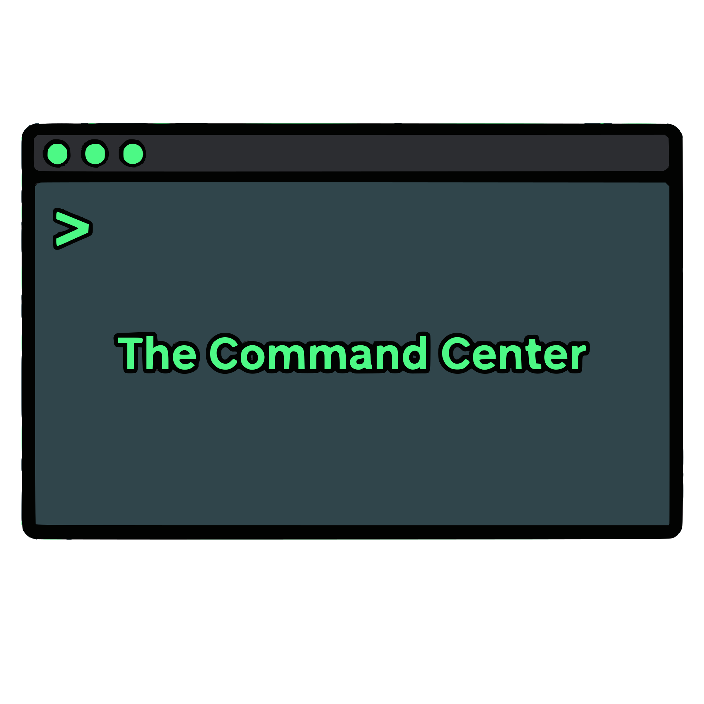

  

<a id="readme-top"></a>
[![Contributors][contributors-shield]][contributors-url]
[![Forks][forks-shield]][forks-url]
[![Stargazers][stars-shield]][stars-url]
[![Issues][issues-shield]][issues-url]
[![Unlicense License][license-shield]][license-url]
[![LinkedIn][linkedin-shield]][linkedin-url]


<div align="center">
<a href="https://github.com/SebbyB/The-Command-Center">



</a>

  <h3 align="center">The Command Center</h3>

  <p align="center">
    An interactive terminal-based site for prototyping
    <br />
    <a href="https://github.com/SebbyB/The-Command-Center"><strong>Explore the docs »</strong></a>
    <br />
    <br />
    <a href="Trustingcarton.com">View Demo</a>
    &middot;
    <a href="">Report Bug</a>
    &middot;
    <a href="">Request Feature</a>
  </p>
</div>


<details>
  <summary>Table of Contents</summary>
  <ol>
    <li>
      <a href="#about-the-project">About The Project</a>
      <ul>
        <li><a href="#built-with">Built With</a></li>
      </ul>
    </li>
    <li>
      <a href="#getting-started">Getting Started</a>
      <ul>
        <li><a href="#prerequisites">Prerequisites</a></li>
        <li><a href="#installation">Installation</a></li>
      </ul>
    </li>
    <li><a href="#usage">Usage</a></li>
    <li><a href="#roadmap">Roadmap</a></li>
    <li><a href="#contributing">Contributing</a></li>
    <li><a href="#license">License</a></li>
    <li><a href="#contact">Contact</a></li>
    <li><a href="#acknowledgments">Acknowledgments</a></li>
  </ol>
</details>


## About The Project

The Command Center is a framework built around a persistent terminal interface. The screen is split into two layers: a viewport (top) that renders content sections, and a terminal panel (bottom) that acts as the primary navigation mechanism. Users navigate the site by typing Unix-like commands — `cd`, `ls`, `cat` — against a virtual filesystem that maps to pages and sections.

The original concept for this project was inspired by JCubic's Jquery terminal emulator. When I was first learning embedded development on ESP32 boards, I would use a webserver hosted by the ESP32 and a websocket connection to utilize different sensors and collect data. I wanted a more visual way of doing this approach that included a combination of command line style navigation and site navigation.

### Key features:
* **Terminal navigation** — move between sections using `cd`, list contents with `ls`, read file content with `cat`
* **Virtual filesystem** — content is organised as a tree of directories and pages defined in TypeScript
* **Python content tools** — scripts in `tools/` convert Markdown files into typed page definitions and wire them into the filesystem automatically
* **Minimisable terminal panel** — the terminal collapses to a title bar so the viewport content can be read full-screen
* **Under construction mode** — set `VITE_UNDER_CONSTRUCTION=true` to show a holding page without rebuilding content
* **URL-addressable paths** — the virtual filesystem path is reflected in the browser URL, so pages are directly linkable

<p align="right">(<a href="#readme-top">back to top</a>)</p>


### Built With

* [![React][React.js]][React-url]
* [![TypeScript][TypeScript]][TypeScript-url]
* [![Vite][Vite]][Vite-url]
* [![TailwindCSS][TailwindCSS]][TailwindCSS-url]
* [![Python][Python]][Python-url]

<p align="right">(<a href="#readme-top">back to top</a>)</p>


## Getting Started

### Prerequisites

* Node.js (v18+) and npm
* Python 3 (for the content tools)

### Installation

1. Clone the repo
   ```sh
   git clone https://github.com/SebbyB/The-Command-Center.git
   cd The-Command-Center
   ```
2. Install dependencies
   ```sh
   npm install
   ```
3. Copy the example env file and configure as needed
   ```sh
   cp .env.example .env
   ```
4. Start the dev server
   ```sh
   npm run dev
   ```

<p align="right">(<a href="#readme-top">back to top</a>)</p>


## Usage

Navigate the site from the terminal panel at the bottom of the screen:

```sh
ls                  # list the current directory's contents
cd section         # navigate into a section
cd ..               # go up one level
cat file           # display a file's content inline
clear               # clear terminal output
whoami              # display site info
animations          # toggle typewriter animation on/off
help                # list all available commands
```

To add a new page from a Markdown file, use the content tools:

```sh
python tools/md_to_page.py content/projects/my-project.md
```

This converts the Markdown, registers the page in the filesystem, and wires it into the section index automatically.

<p align="right">(<a href="#readme-top">back to top</a>)</p>


<!-- ROADMAP -->
## Roadmap

- [x] Terminal navigation with virtual filesystem
- [x] Python content tooling (add/remove/toggle pages)
- [x] Minimisable terminal panel
- [x] URL-addressable paths
- [x] Under construction mode
- [ ] Hidden Directories
- [ ] Tab completion
- [ ] Embedded Systems Build Tools
- [ ] Real time terminal Websocket Support

See the [open issues](https://github.com/SebbyB/The-Command-Center/issues) for a full list of proposed features (and known issues).

<p align="right">(<a href="#readme-top">back to top</a>)</p>


<!-- CONTRIBUTING -->
## Contributing

Contributions are welcome. If you have a suggestion, fork the repo and open a pull request, or open an issue with the tag "enhancement".

1. Fork the Project
2. Create your Feature Branch (`git checkout -b feature/AmazingFeature`)
3. Commit your Changes (`git commit -m 'Add some AmazingFeature'`)
4. Push to the Branch (`git push origin feature/AmazingFeature`)
5. Open a Pull Request

### Top contributors:

<a href="https://github.com/SebbyB/The-Command-Center/graphs/contributors">
  
</a>

<p align="right">(<a href="#readme-top">back to top</a>)</p>


<!-- LICENSE -->
## License

Distributed under the Unlicense License. See `LICENSE.txt` for more information.

<p align="right">(<a href="#readme-top">back to top</a>)</p>


<!-- CONTACT -->
## Contact

Sebastian Barney - [LinkedIn](https://www.linkedin.com/in/sebastianbarney1/)

Project Link: [https://github.com/SebbyB/The-Command-Center](https://github.com/SebbyB/The-Command-Center)

<p align="right">(<a href="#readme-top">back to top</a>)</p>


<!-- ACKNOWLEDGMENTS -->
## Acknowledgments

* [Best-README-Template](https://github.com/othneildrew/Best-README-Template) — README structure
* [Img Shields](https://shields.io) — badge generation
* [JetBrains Mono](https://www.jetbrains.com/lp/mono/) — terminal font
* [marked](https://marked.js.org/) — Markdown parsing
* [Jcubic Terminal Emulator](https://github.com/jcubic/jquery.terminal) - Project inspiration.

<p align="right">(<a href="#readme-top">back to top</a>)</p>


<!-- MARKDOWN LINKS & IMAGES -->
<!-- https://www.markdownguide.org/basic-syntax/#reference-style-links -->
[contributors-shield]: https://img.shields.io/github/contributors/SebbyB/The-Command-Center.svg?style=for-the-badge
[contributors-url]: https://github.com/SebbyB/The-Command-Center/graphs/contributors
[forks-shield]: https://img.shields.io/github/forks/SebbyB/The-Command-Center.svg?style=for-the-badge
[forks-url]: https://github.com/SebbyB/The-Command-Center/network/members
[stars-shield]: https://img.shields.io/github/stars/SebbyB/The-Command-Center.svg?style=for-the-badge
[stars-url]: https://github.com/SebbyB/The-Command-Center/stargazers
[issues-shield]: https://img.shields.io/github/issues/SebbyB/The-Command-Center.svg?style=for-the-badge
[issues-url]: https://github.com/SebbyB/The-Command-Center/issues
[license-shield]: https://img.shields.io/github/license/SebbyB/The-Command-Center.svg?style=for-the-badge
[license-url]: https://github.com/SebbyB/The-Command-Center/blob/master/LICENSE.txt
[linkedin-shield]: https://img.shields.io/badge/-LinkedIn-black.svg?style=for-the-badge&logo=linkedin&colorB=555
[linkedin-url]: https://linkedin.com/in/sebastianburton
[product-screenshot]: images/screenshot.png
[React.js]: https://img.shields.io/badge/React-20232A?style=for-the-badge&logo=react&logoColor=61DAFB
[React-url]: https://reactjs.org/
[TypeScript]: https://img.shields.io/badge/TypeScript-007ACC?style=for-the-badge&logo=typescript&logoColor=white
[TypeScript-url]: https://www.typescriptlang.org/
[Vite]: https://img.shields.io/badge/Vite-646CFF?style=for-the-badge&logo=vite&logoColor=white
[Vite-url]: https://vitejs.dev/
[TailwindCSS]: https://img.shields.io/badge/Tailwind_CSS-38B2AC?style=for-the-badge&logo=tailwind-css&logoColor=white
[TailwindCSS-url]: https://tailwindcss.com/
[Python]: https://img.shields.io/badge/Python-3776AB?style=for-the-badge&logo=python&logoColor=white
[Python-url]: https://www.python.org/
